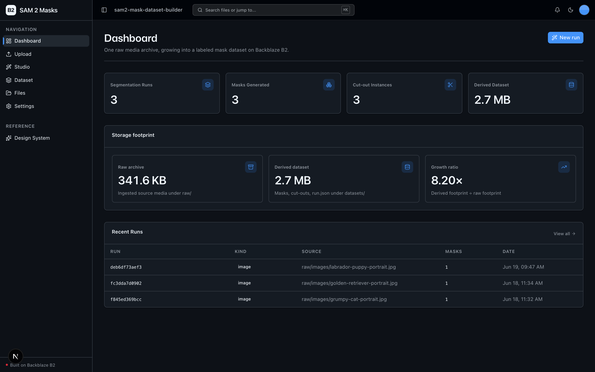
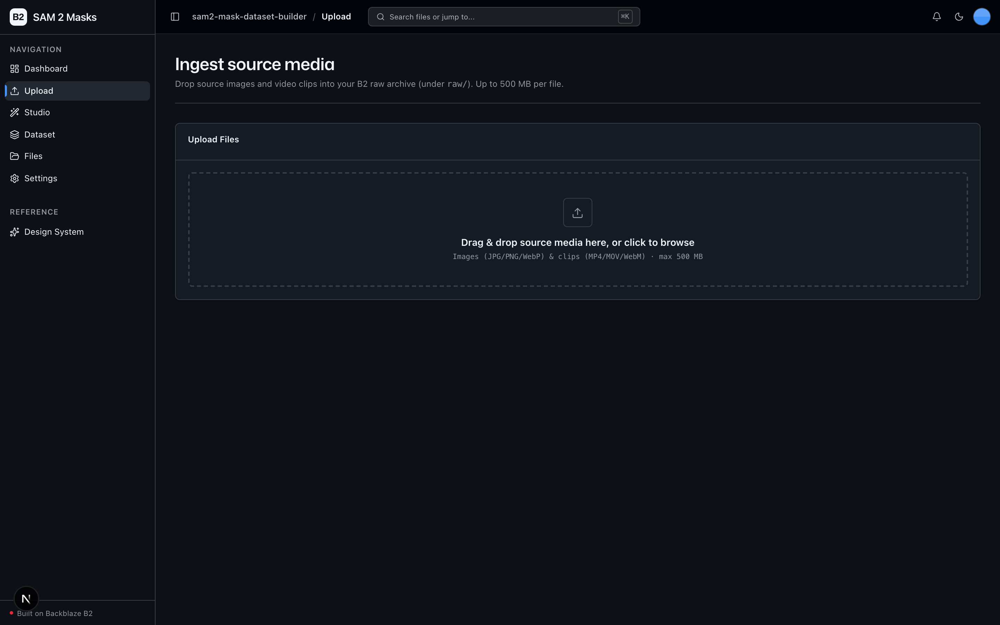
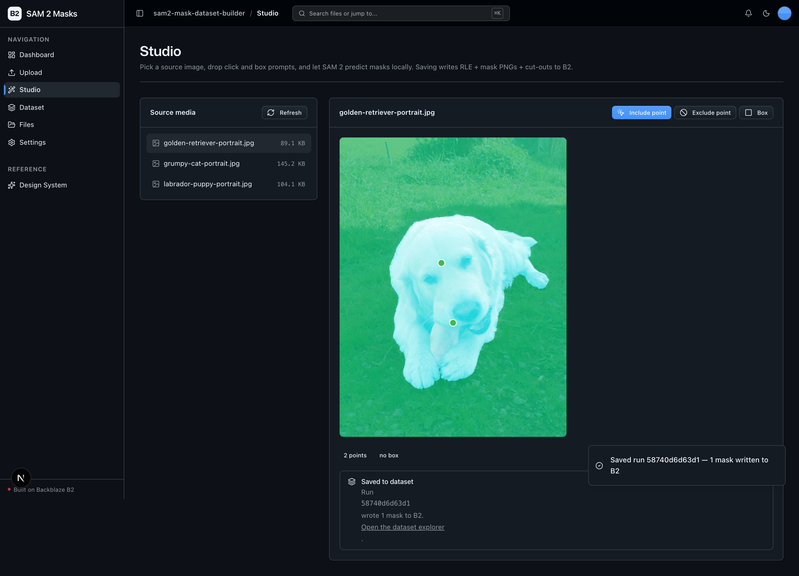
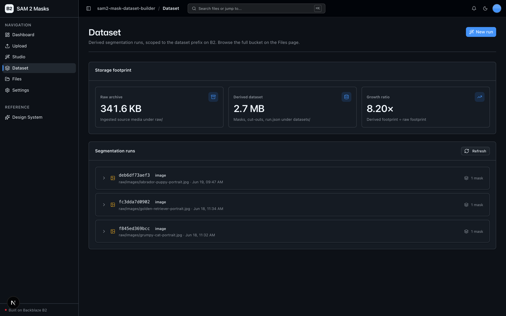
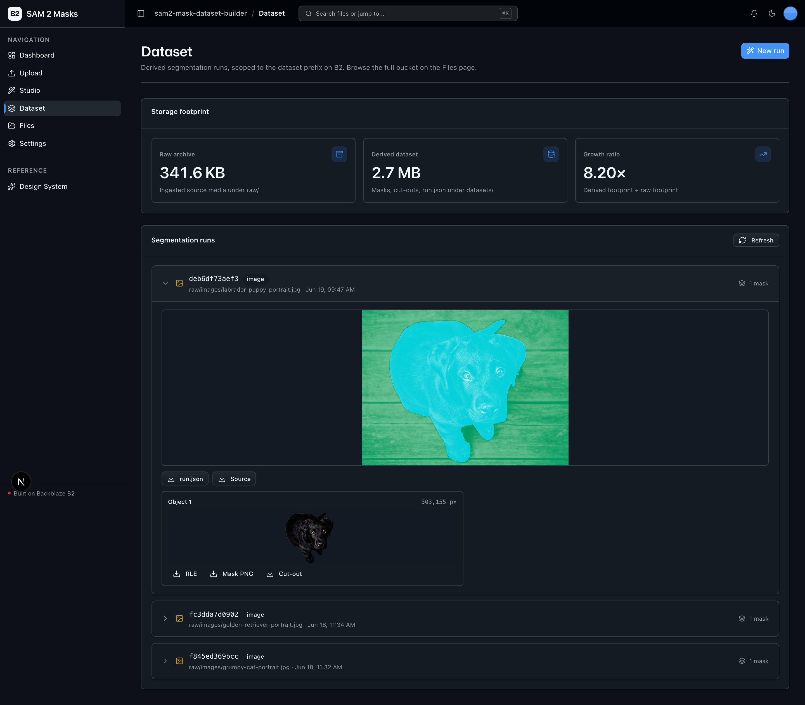

<!-- last_verified: 2026-06-25 -->
# SAM 2 Mask Dataset Builder

Turn a raw media archive on **[Backblaze B2](https://www.backblaze.com/sign-up/ai-cloud-storage?utm_source=github&utm_medium=referral&utm_campaign=ai_artifacts&utm_content=b2ai-sam2-mask-builder)** into a reusable, versioned **segmentation dataset** — with no second API key. Source images and video clips live in B2. A lightweight studio lets you drop **click and box prompts** on an image (or the first frame of a clip); **Meta's Segment Anything 2 (SAM 2) runs locally**, predicting masks per prompt and propagating them across video frames. Every run writes its derived artifacts — COCO **RLE JSON**, **binary mask PNGs**, transparent **cut-out instances**, and per-run/per-frame **metadata** — back to B2 alongside the source. Downstream training pipelines and reviewers read the result straight off B2 via presigned URLs.

**The B2 story:** one raw image archive becomes a multi-layer labeled dataset whose derived footprint matches or exceeds the originals — and it runs on local OSS with **B2 credentials only**.

**What you get out of the box:**
- A promptable **segmentation Studio** (click points + box prompts) backed by local SAM 2
- **Video mask propagation** — prompt the first frame, propagate across the clip
- **Mask dataset writeback** to B2: RLE JSON + mask PNGs + cut-outs + run metadata
- A **scoped dataset explorer** (`/dataset`) for derived runs, plus the full-bucket **File Explorer** (`/files`)
- A **footprint dashboard** showing raw-vs-derived storage growth
- FastAPI backend with strict layered architecture and structural tests; agent-optimized docs

## What it looks like

**Dashboard** — segmentation-run, mask, and cut-out counts with a raw-vs-derived storage footprint showing how the dataset grows past the originals on B2.



**Ingest** — drag-and-drop images and video clips into the B2 `raw/` archive (up to 500 MB per file).



**Studio** — pick a source, drop include/exclude points (and a box), and run local SAM 2 to preview the predicted mask before saving the run to B2.



**Dataset** — a scoped explorer of derived runs under the dataset prefix, with the storage footprint and per-run mask counts.



**Dataset run (expanded)** — open a run to see its source-plus-mask composite, per-object cut-outs, and one-click downloads for the RLE JSON, mask PNG, and cut-out.



## How it works

```
Ingest (raw/)          Prompt + Segment            Write to B2 (datasets/)        Browse + Train
─────────────          ────────────────            ──────────────────────        ──────────────
images / clips   ──▶   click & box prompts   ──▶   RLE JSON                 ──▶   /dataset explorer
                       SAM 2 (local, keyless)      mask PNGs                       presigned downloads
                                                   cut-out PNGs                    footprint dashboard
                                                   run.json
```

## The SAM 2 model

- SAM 2 runs **locally** — there is no inference API and **no second API key**. Model weights download from the public **HuggingFace Hub** on first use.
- Default model is `facebook/sam2.1-hiera-tiny` (the smallest variant), set via `SAM2_MODEL_ID`.
- **GPU recommended.** Image segmentation works on CPU (slower); **video propagation is heavy — a GPU is strongly recommended.**
- `torch` / `sam2` are confined to the `repo/` layer (`app/repo/sam2_engine.py`), the same way `boto3` is — a structural test enforces the boundary.

## Quick Start

You need: Node.js >= 20, pnpm 10.25.0 via Corepack, Python >= 3.11, and a free **[Backblaze B2 account](https://www.backblaze.com/sign-up/ai-cloud-storage?utm_source=github&utm_medium=referral&utm_campaign=ai_artifacts&utm_content=b2ai-sam2-mask-builder)**.

**1. Install dependencies**

```bash
corepack enable
pnpm install
```

**2. Set up the backend**

```bash
cd services/api
python -m venv .venv && source .venv/bin/activate
pip install -r requirements.txt
cd ../..
```

> `requirements.txt` pulls `torch`, `torchvision`, and `sam2` (installed from the official source repo, `git+https://github.com/facebookresearch/sam2.git`). On a GPU host, install the CUDA build of `torch` that matches your driver first.

**3. Add your B2 credentials**

```bash
cp .env.example .env
```

Open `.env` and head to the [Backblaze B2 dashboard](https://secure.backblaze.com/b2_buckets.htm?utm_source=github&utm_medium=referral&utm_campaign=ai_artifacts&utm_content=b2ai-sam2-mask-builder):

1. **Create a bucket.** Paste into `.env`:
   - **Bucket Unique Name** → `B2_BUCKET_NAME`
   - The bucket's region (e.g. `us-west-004`) → `B2_REGION` *(the S3 endpoint is derived as `https://s3.{B2_REGION}.backblazeb2.com`)*
   - The bucket's S3 base URL → `B2_PUBLIC_URL_BASE` (e.g. `https://<bucket>.s3.<region>.backblazeb2.com`)
2. **Create an application key** with `Read and Write` permission. Paste into `.env`:
   - **keyID** → `B2_APPLICATION_KEY_ID`
   - **applicationKey** → `B2_APPLICATION_KEY` *(only shown once)*

> Want a walkthrough? See the docs for [creating a bucket](https://www.backblaze.com/docs/cloud-storage-create-and-manage-buckets?utm_source=github&utm_medium=referral&utm_campaign=ai_artifacts&utm_content=b2ai-sam2-mask-builder) and [creating app keys](https://www.backblaze.com/docs/cloud-storage-create-and-manage-app-keys?utm_source=github&utm_medium=referral&utm_campaign=ai_artifacts&utm_content=b2ai-sam2-mask-builder).

**4. Run it**

```bash
pnpm dev
```

Frontend at `localhost:3000`, API at `localhost:8000`. `pnpm dev` runs `pnpm doctor` first — a preflight check that catches common setup gotchas (wrong Node/Python version, missing venv, missing or placeholder `.env`, ports taken). Run it standalone any time with `pnpm doctor`.

## The 5-step workflow

1. **Ingest** (`/upload`) — drop source images / video clips into B2 under `raw/`.
2. **Prompt & segment** (`/studio`) — pick a source, drop include/exclude click points and a box, run SAM 2.
3. **Save to dataset** — the run writes RLE + mask PNGs + cut-outs + `run.json` under `datasets/<run_id>/`.
4. **Browse** (`/dataset`) — review derived runs scoped to the dataset prefix, download artifacts via presigned URLs. The full bucket stays browsable on `/files`.
5. **Track growth** (`/`) — the dashboard shows runs, masks, cut-outs, and raw-vs-derived footprint.

## Dataset layout on B2

```
raw/images/<name>.<ext>                       ingested source images
raw/videos/<name>.<ext>                       ingested source clips
datasets/<run_id>/run.json                    per-run metadata
datasets/<run_id>/masks/obj_<id>_rle.json     COCO RLE JSON
datasets/<run_id>/masks/obj_<id>_mask.png     binary mask PNG
datasets/<run_id>/cutouts/obj_<id>.png        transparent cut-out
datasets/<run_id>/masks/frames/<n>/...        per-frame masks (video propagation)
```

`SOURCE_PREFIX` (default `raw/`) and `DATASET_PREFIX` (default `datasets/`) are configurable in `.env`.

## Core Features

- [Ingest](docs/features/file-upload.md) — drag-and-drop source images/clips into the B2 raw archive
- [Segmentation Studio](docs/features/segmentation.md) — click-point and box prompts; SAM 2 image + video paths
- [Mask Dataset](docs/features/mask-dataset.md) — RLE/PNG/cut-out artifacts, scoped explorer, presigned access
- [Dashboard](docs/features/dashboard.md) — runs, masks, cut-outs, raw-vs-derived footprint
- [File Browser](docs/features/file-browser.md) — full-bucket browse, preview, download, delete
- [Metadata Extraction](docs/features/metadata-extraction.md) — image dimensions/EXIF, video duration, checksums
- [Design System](docs/design-system.md) — tokens, primitives, error/empty states. Live preview at `/design`.

## Tech Stack

- TypeScript, Next.js 16, React 19, Tailwind v4, shadcn/ui, Recharts
- TanStack Query — caching, dedup, retry for every fetch
- Python 3.11+, FastAPI, boto3, Pydantic v2, Pillow
- **SAM 2** (`facebook/sam2.1-hiera-tiny` by default), PyTorch, pycocotools, OpenCV — all local, keyless
- Backblaze B2 (S3-compatible object storage)
- pnpm workspaces (monorepo)

## Commands

| Command | What it does |
|---------|-------------|
| `pnpm dev` | Start frontend + backend |
| `pnpm dev:web` | Frontend only |
| `pnpm dev:api` | Backend only |
| `pnpm build` | Build frontend |
| `pnpm lint` | Lint frontend |
| `pnpm lint:api` | Lint backend (ruff) |
| `pnpm test:api` | Run backend tests (SAM 2 + B2 mocked — no GPU or live bucket needed) |
| `pnpm check:structure` | Verify layering rules |
| `pnpm test:e2e` | Playwright e2e tests (run `pnpm --filter @sam2-mask-dataset-builder/web exec playwright install chromium` once first) |

## Documentation Map

| Doc | Purpose |
|-----|---------|
| [AGENTS.md](AGENTS.md) | Agent table of contents — start here |
| [ARCHITECTURE.md](ARCHITECTURE.md) | System layout, layering, data flows |
| [docs/features/](docs/features/) | Feature docs (ingest, segmentation, mask dataset, dashboard, file browser, metadata) |
| [docs/app-workflows.md](docs/app-workflows.md) | User journeys |
| [docs/dev-workflows.md](docs/dev-workflows.md) | Engineering workflows, SAM 2 model setup, CPU vs GPU |
| [docs/SECURITY.md](docs/SECURITY.md) | Security principles |
| [docs/RELIABILITY.md](docs/RELIABILITY.md) | Reliability expectations |
| [docs/exec-plans/](docs/exec-plans/) | Execution plans and tech debt tracker |

## License

MIT License - see [LICENSE](LICENSE) for details.

## Built with the Vibe Coding Starter Kit

This sample is built on the [Backblaze B2 Vibe Coding Starter Kit](https://github.com/backblaze-b2-samples/vibe-coding-starter-kit) — the layered FastAPI backend, shadcn/ui kit, File Explorer, and agent-first docs come from there.

## Claude Agent B2 Skill

Manage Backblaze B2 from your terminal using natural language (list/search, audits, stale or large file detection, security checks, safe cleanup).

Repo: [https://github.com/backblaze-b2-samples/claude-skill-b2-cloud-storage](https://github.com/backblaze-b2-samples/claude-skill-b2-cloud-storage)
